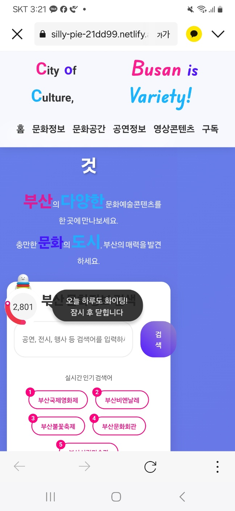
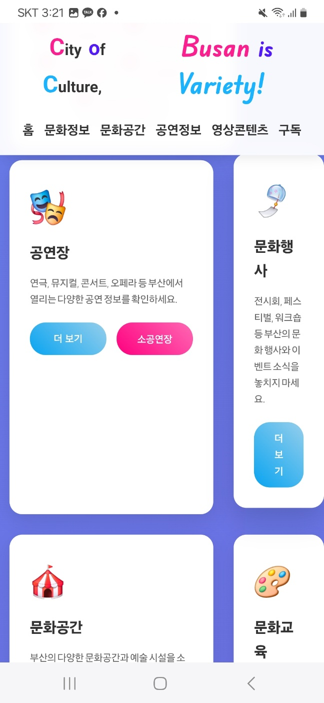
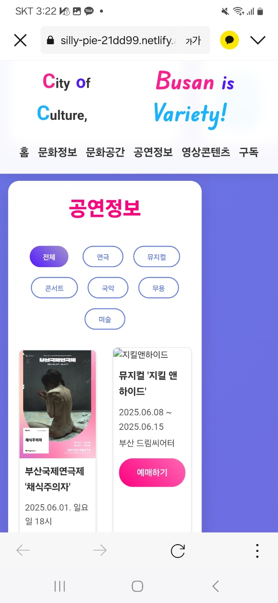
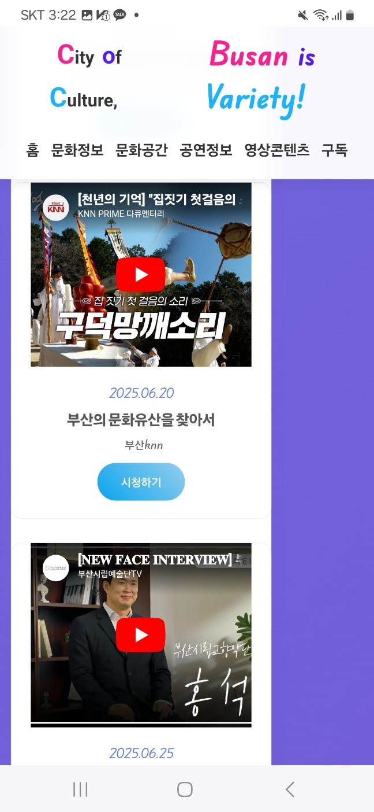
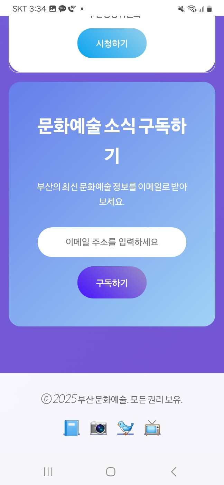

부산 문화예술 정보 홈페이지
📋 프로젝트 개요
부산의 다양한 문화예술 정보를 한눈에 볼 수 있는 종합 정보 플랫폼입니다. 공연, 행사, 교육 프로그램 등 부산의 풍부한 문화 콘텐츠를 시민들에게 제공합니다.
슬로건: "City of Culture, Busan is Variety!"
🌐 배포 링크

라이브 사이트: https://busan-culture.netlify.app
개발 환경: https://dev-busan-culture.netlify.app
스테이징: https://staging-busan-culture.netlify.app
웹주소: https://silly-pie-21dd99.netlify.app

📸 스크린샷
메인 페이지

부산 문화예술의 다양한 정보를 한눈에 볼 수 있는 메인 페이지

문화공간 페이지

부산의 주요 문화 공연,행사, 공간 및 교육을 안내하는 페이지

공연정보 페이지

실시간 공연 일정과 티켓 예매 정보를 제공하는 페이지

영상콘텐츠 페이지

부산의 주요 문화 공연,행사, 공간 및 교육을 안내하는 페이지

이메일구독 페이지

부산의 주요 문화정보를 이메일주소를 넣고 뉴스레터를 구독하는 페이지

모바일 반응형

  
  
  
  
  

*모바일 환경에 최적화된 반응형 디자인*
✨ 주요 기능
🎭 문화정보

부산 지역 문화 소식 및 트렌드
문화예술 관련 뉴스 및 정보
문화 정책 및 지원사업 안내

🎪 공연정보

연극, 뮤지컬, 콘서트 등 공연 일정
티켓 예매 정보 및 가격 안내
공연장별 상세 정보

🏛️ 문화공간

부산 내 주요 문화시설 안내
미술관, 박물관, 공연장 정보
시설 이용 안내 및 예약 시스템

📹 영상콘텐츠

문화예술 관련 영상 자료
공연 하이라이트 및 인터뷰
문화공간 소개 영상

📚 교육 및 구독

문화예술 교육 프로그램 안내
워크숍 및 강좌 정보
뉴스레터 구독 서비스

🛠️ 기술 스택
Frontend

HTML5
CSS3 (반응형 웹 디자인)
JavaScript (ES6+)
Bootstrap 또는 Tailwind CSS (선택사항)

Backend (예상)

Node.js / Express.js
또는 PHP / Laravel
또는 Python / Django

데이터베이스

MySQL / PostgreSQL
또는 MongoDB

기타 도구

Git (버전 관리)
이미지 최적화 도구
SEO 최적화

📁 프로젝트 구조
busan-culture-website/
├── index.html              # 메인 홈페이지
├── css/
│   ├── style.css          # 메인 스타일시트
│   ├── responsive.css     # 반응형 스타일
│   └── components/        # 컴포넌트별 CSS
├── js/
│   ├── main.js           # 메인 JavaScript
│   ├── components/       # 컴포넌트별 JS
│   └── utils/           # 유틸리티 함수
├── images/
│   ├── logo/            # 로고 이미지
│   ├── banners/         # 배너 이미지
│   └── content/         # 콘텐츠 이미지
├── screenshots/         # README용 스크린샷
│   ├── homepage.png
│   ├── performances.png
│   ├── cultural-spaces.png
│   ├── mobile-home.png
│   └── mobile-menu.png
├── pages/
│   ├── culture-info.html    # 문화정보 페이지
│   ├── performances.html   # 공연정보 페이지
│   ├── cultural-spaces.html # 문화공간 페이지
│   ├── videos.html         # 영상콘텐츠 페이지
│   └── education.html      # 교육/구독 페이지
└── assets/
    ├── fonts/           # 웹폰트
    └── icons/           # 아이콘 파일
🚀 설치 및 실행
개발 환경 설정
bash# 저장소 클론
git clone https://github.com/username/busan-culture-website.git

# 프로젝트 디렉토리 이동
cd busan-culture-website

# 의존성 설치 (Node.js 사용 시)
npm install

# 개발 서버 실행
npm start
브라우저에서 확인
http://localhost:3000
🎨 디자인 가이드라인
컬러 팔레트

Primary Color: #2E86C1 (파란색 - 바다를 상징)
Secondary Color: #F39C12 (주황색 - 활기찬 문화)
Accent Color: #E74C3C (빨간색 - 열정)
Background: #F8F9FA (밝은 회색)
Text: #2C3E50 (진한 회색)

타이포그래피

한글: Noto Sans KR
영문: Roboto
제목: 굵은 글씨 (700)
본문: 일반 글씨 (400)

반응형 브레이크포인트

Mobile: 320px ~ 767px
Tablet: 768px ~ 1023px
Desktop: 1024px 이상

📱 주요 페이지
1. 홈페이지 (index.html)

메인 비주얼 배너
최신 공연 정보 미리보기
인기 문화공간 소개
뉴스 및 공지사항

2. 문화정보 (culture-info.html)

부산 문화 뉴스
문화 정책 정보
문화예술 트렌드

3. 공연정보 (performances.html)

공연 일정 캘린더
장르별 공연 분류
티켓 예매 링크

4. 문화공간 (cultural-spaces.html)

지도 기반 문화시설 검색
시설별 상세 정보
이용 안내 및 예약

5. 영상콘텐츠 (videos.html)

유튜브 연동 영상 갤러리
카테고리별 영상 분류
영상 검색 기능

6. 교육/구독 (education.html)

문화예술 교육 프로그램
뉴스레터 구독 폼
이벤트 참여 안내

🔧 개발 참고사항
SEO 최적화

메타 태그 설정
구조화된 데이터 마크업
사이트맵 생성
Open Graph 태그

접근성 (Accessibility)

ARIA 레이블 사용
키보드 네비게이션 지원
색상 대비 준수
스크린 리더 호환성

성능 최적화

이미지 최적화 (WebP 포맷 사용)
CSS/JS 파일 압축
브라우저 캐싱 설정
CDN 활용

구글 애널리틱스 연동

데이터 검색
데이터 수집
데이터 분석

🤝 기여 방법

Fork the repository
Create a feature branch: git checkout -b feature/new-feature
Commit your changes: git commit -am 'Add new feature'
Push to the branch: git push origin feature/new-feature
Submit a pull request

📄 라이선스
이 프로젝트는 MIT 라이선스 하에 배포됩니다. 자세한 내용은 LICENSE 파일을 참조하세요.
📞 연락처

프로젝트 관리자: [LEE DONG JU]
이메일: sonialeepy@gmail.com
웹사이트: https://culture.busan.kr
GitHub: https://github.com/username/busan-culture-website

🗺️ 로드맵
Phase 1 (현재)

 기본 웹사이트 구조 설계
 메인 페이지 개발
 반응형 디자인 구현

Phase 2 (계획)

 백엔드 API 개발
 데이터베이스 연동
 사용자 인증 시스템

Phase 3 (향후)

 모바일 앱 개발
 AI 기반 추천 시스템
 다국어 지원 (영어, 중국어, 일본어)

부산의 문화예술을 세상에 알리는 디지털 플랫폼 🌊🎭
